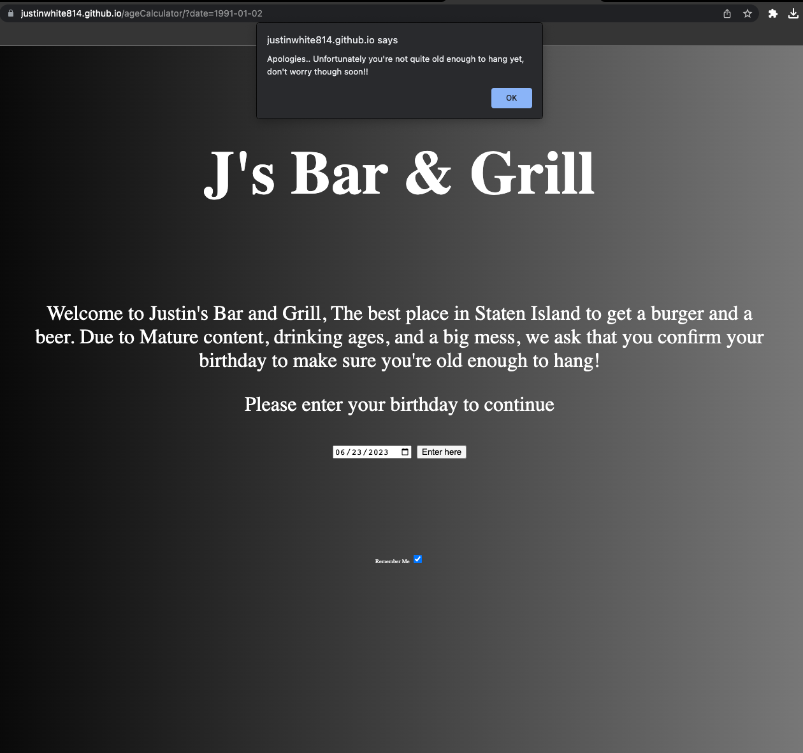
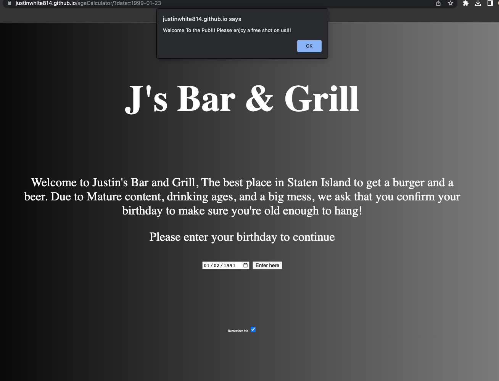

# ageCalculator

 

## Description
>Welcome to the age calculator! This was a fun coding challenge that I decided to make into a fun project. It's an age validator and if you are 21 or older 
you are permitted access. Otherwise you cannot get in. It's an interesting project. 

[Live Link](https://justinwhite814.github.io/ageCalculator/)

## Installation Instructions
* Fork this repository
* Clone it down to your local machine
* Open in a code editor
* Use your code editor to go live or run a live server

## Screen shots
#### Main Page

#### No Entry Alert

#### Welcome Alert

## Minimun Viable Product
* Displaying a web page that uses age verification
* Creating Alerts upon user entry or exit
* Quality level Styling

## User Stories
- As a user I want to know if I'm allowed to enter
- As a user I want to a welcome message when I arrive
- As a user I want to verify if I am born after a certain date that I am 21

## Technologies Used:
* HTML
* CSS
* JavaScript
